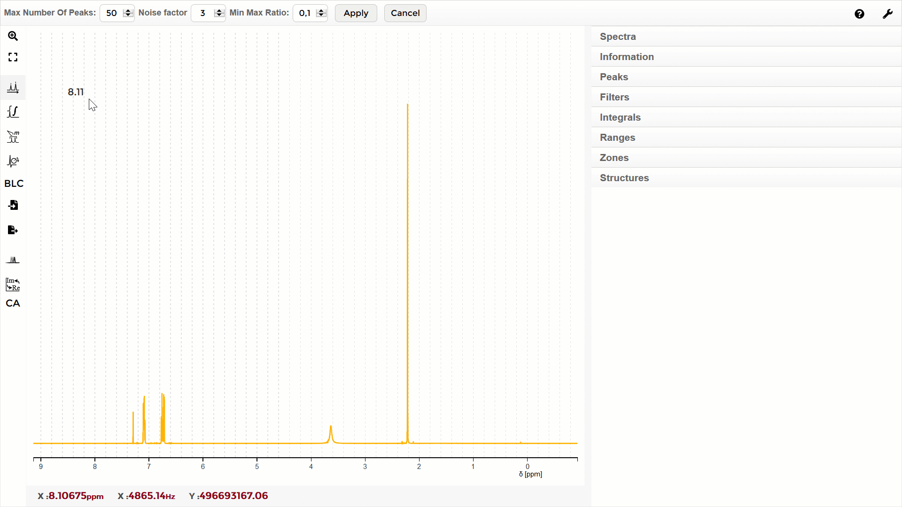
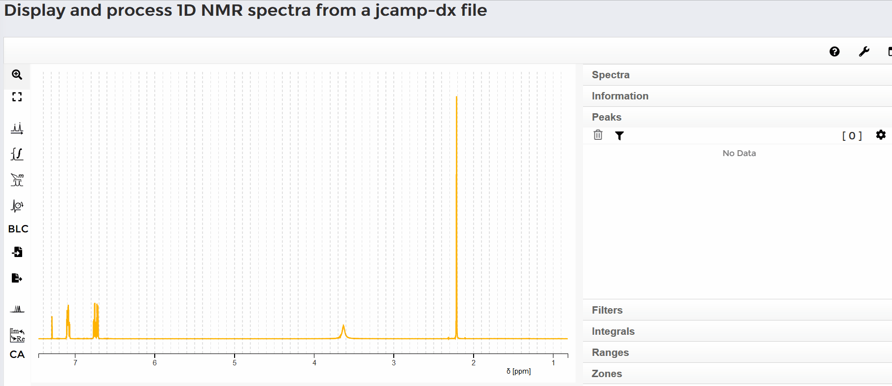
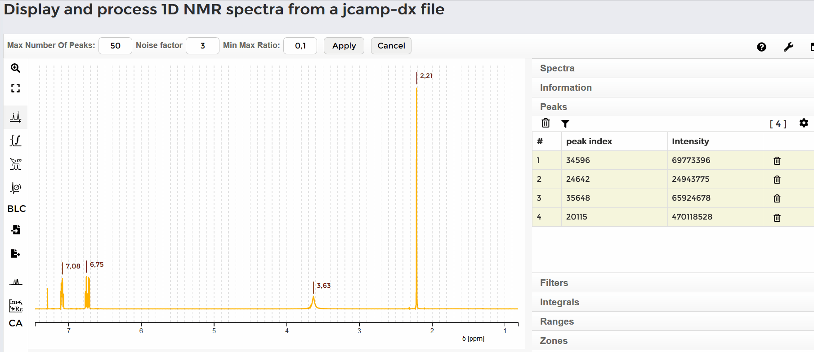
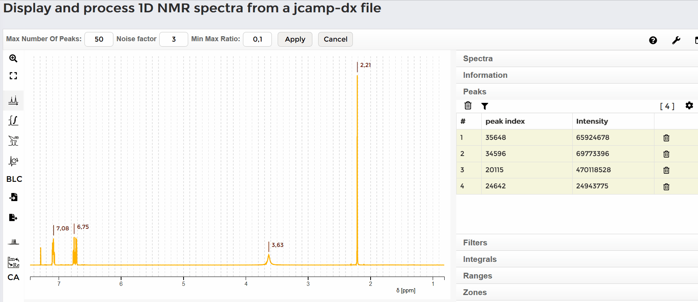

# Peaks and Reference

## Peak Picking

### Select a single signal

To select a single signal, click the "peaks picking" button. Move the mouse to the selected signal and click on it with the left mouse button. The peak shift appears over the signal. The exact value of the signal can be found in a table on the right side of the interface under the "peaks" tab.

### Automatic single peak picking

You mark a signal by simultaneously holding down the shift key and the left mouse button and moving the mouse over the range of the signal. After releasing both keys, the shift of the signal appears. On the right side of the screen, under the "Peaks" tab, a list of all selected signals is listed. If you move the mouse over the shift of the signal in the spectrum, the corresponding entry is displayed in the list. A signal is listed for the range that has been marked with the mouse: The range is stored as a multiplet, which has to be analyzed more precisely with "range peaking". If you move the mouse over a certain line in the list, the corresponding shift in the spectrum is marked.

## Panel "Peaks"

All signals are shown in the Peaks panel. The signals highlighted in yellow can be observed in the section of the spectrum shown. The signals highlighted in white are not visible in the screen section. If you switch off the zoom by double-clicking, the signals of the whole shown spectrum are highlighted in yellow. 

If you click on the funnel button, only the signals shown on the screen are listed. To see all the signals in the list again, press the Funnel button a second time.

On the right side of the panel, the total number of listed signals is shown in a square bracket. 

You can display various information in the peaks panel. Click on the gear wheel at the top right. All measured nuclei will be displayed. You can choose to display the following values for each nucleus:

-   Peak Number
-   Peak Index
-   Chemical shift (ppm)
-   Chemical shift (Hz)
-   Width
-   Intensity

Place a check mark next to the values that you want to have displayed for the respective nucleus. Then click on the green check mark at the top right.

## Set a Reference

Click the Peaks Picking button to the left of the spectrum. Find your solvent signal (or the reference signal). When you point at it with the crosshairs, press the shift key and the left mouse button at the same time. The value of the signal will be shown both in the spectrum and in a list on the right side of the spectrum in the Peaks field. Select one of the two displayed values (in the spectrum single click with the left mouse button, in the list double click with the left mouse button) and enter the correct reference value.

## Remove a Peak

### Delete all peaks

To delete all signals move the mouse to the list "Peaks" and press the trash button on the left side above the list. A red box apears. Click "yes". All signals are deleted.

### Delete a single peak

To delete one signal move the mouse to the list and select a signal. Press the trash button on the rigth side of the line of the signal. The peak is deleted.

An alternative way is to move the mouse over a signal in the spectrum. A red ring appears. Click this red ring, the peak is deleted.

